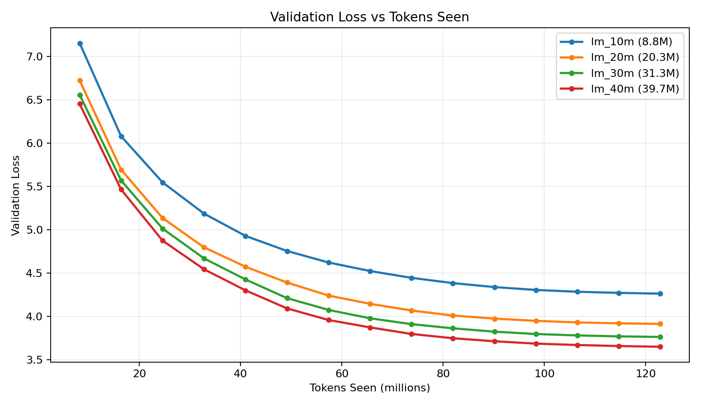
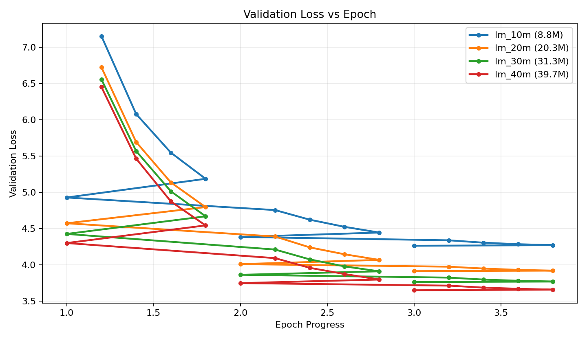

# Tiniest Decoder

This repo is an ablation study for tiny decoder-only language models. The experiment keeps the data, tokenizer, environment, optimizer settings, context length, and effective token budget as constant as possible, then compares how different decoder sizes learn.

The main goal is not to train a large general assistant. The goal is to learn how far very small decoders can go when the data pipeline, objective, tokenizer, model size, and finetuning stages are designed carefully.

The current study compares approximately 9M, 20M, 31M, and 40M parameter decoder configs on the same base LM corpus. Once the base LM behavior is coherent, later iterations will add narrow task skills such as OCR-style field extraction, instruction parsing, and autocomplete.

## Ablation Study Goal

The core question is:

> With the same data and same training environment, how much does decoder size alone change learning quality?

To make that comparison meaningful, each model-size run should keep these fixed:

- same tokenizer
- same LM dataset
- same sequence length
- same number of epochs or tokens seen
- same validation split
- same learning-rate schedule
- same effective tokens per optimizer update
- same GPU class and mixed-precision settings

Only the model config and the physical batch/accumulation split should change. The physical batch size changes because larger models need more VRAM, but gradient accumulation is adjusted to keep the effective token budget per update constant.

## Current Direction

We are using an iterative approach:

1. Build a tiny decoder and train a base language model.
2. Test whether it can do basic next-token continuation.
3. Only after the base LM is coherent, add task-specific training.
4. Keep technical notes from each iteration so future runs do not repeat the same mistakes.

The current reset is focused on base LM quality first. OCR, instruction parsing, and autocomplete will come later after the plain language model behaves sensibly.

The main experiment design is to keep the dataset and training settings constant, then compare how different tiny parameter counts learn across the same epochs, steps, and token budget. Each run writes metadata and CSV metrics so model-size comparisons are explicit.

## Iteration 1: Failed Mixed-Stage Training

The first iteration trained a small decoder with about 20M parameters:

- 8 layers
- 384 hidden size
- 6 attention heads
- 16k SentencePiece vocabulary
- About 20.3M parameters

Training was split into three stages:

- Stage 1: plain language modeling on a mixed corpus
- Stage 2: supervised OCR/instruction datasets
- Stage 3: OCR/instruction/autocomplete mixture

The model trained without crashing, but the final checkpoint was not useful as a language model. In Gradio, plain continuation often repeated the last token or fell into subword loops such as repeated fragments. Sampling helped slightly, but did not fix the underlying model quality.

## Why Iteration 1 Failed

### Padding Was Trained As A Target

Stage 1 padded short examples with token `0`, but labels also used token `0`. That means the loss taught the model to predict `<pad>` after many short examples.

For language modeling, padding positions should be ignored with label `-100`, so they do not contribute to cross-entropy loss.

Further reading:

- PyTorch `CrossEntropyLoss` and `ignore_index`: https://pytorch.org/docs/stable/generated/torch.nn.CrossEntropyLoss.html

### The Base LM Data Was Too Fragmented

Stage 1 mostly used short independent lines: user questions, search queries, captions, and OCR-like text. Most rows were much shorter than the 256-token training length.

This made the model see many tiny fragments instead of dense, continuous language. A decoder-only LM learns better when text is packed into full token chunks.

Further reading:

- Hugging Face causal language modeling guide: https://huggingface.co/docs/transformers/tasks/language_modeling
- Token packing discussion in language modeling: https://huggingface.co/docs/trl/sft_trainer#packing

### Stage 3 Overwrote Base LM Behavior

Stage 3 was dominated by short task rows, especially MS MARCO next-word autocomplete examples. That objective is not the same as broad language modeling.

A tiny model can forget base language behavior quickly if finetuning is mostly task-format outputs. This is a form of catastrophic forgetting.

Further reading:

- Catastrophic forgetting overview: https://en.wikipedia.org/wiki/Catastrophic_interference

### Label Smoothing Was Not Helpful Here

The first run used label smoothing during LM training. For a very small decoder learning from scratch, this can make next-token learning less sharp. Iteration 2 uses `label_smoothing=0.0` for base LM.

Further reading:

- Label smoothing paper: https://arxiv.org/abs/1512.00567

### The Model Was Probably Too Small For The Data Mix

20M parameters may be enough for narrow autocomplete if the data is clean, but it was too small for a noisy mixture of questions, captions, OCR text, and supervised task formats. Iteration 2 increases capacity while still targeting a small local GPU.

## Iteration 2: Base LM First

Iteration 2 changes the strategy:

- Train only a base language model first.
- Do not train OCR, instruction, or autocomplete tasks yet.
- Use packed token chunks instead of short padded examples.
- Ignore padding labels correctly.
- Increase the model from about 20M to about 40M parameters.
- Test plain continuation before any task finetuning.

New model config:

- 10 layers
- 512 hidden size
- 8 attention heads
- 2048 FFN size
- 16k vocabulary
- 256 token context for base LM
- About 39.7M parameters

Additional comparison configs are included for smaller runs:

- `model_config_10m.json`: about 8.8M parameters
- `model_config.json`: about 20.3M parameters
- `model_config_30m.json`: about 31.3M parameters
- `model_config_40m.json`: about 39.7M parameters

New files/scripts:

- `model_config_40m.json`
- `data/lm_base/`
- `scripts/prepare_lm_base.sh`
- `scripts/start_lm_base_background.sh`
- `scripts/start_lm_experiment_background.sh`
- `scripts/compare_lm_experiments.py`

The packed LM dataset is built from `data/corpus.txt` into:

- `data/lm_base/train`
- `data/lm_base/val`

The improved prose LM path also adds app-description sources so the base model sees smartphone and application-domain language before task finetuning. Current public sources include Google Play app metadata from MobileRec and Mac App Store description text. These are used as prose documents, not as scraped live store pages.

The first model-size comparison used about 123M tokens seen over three epochs. That was useful for debugging, but it is still small for judging whether 10M, 20M, 30M, and 40M parameter decoders can learn useful language. The next corpus target is roughly 1B tokens while keeping the same document-style LM format.

The expanded prose corpus can stream additional public text from:

- Wikimedia English Wikipedia
- FineWeb-Edu sample text
- app-description sources already used for smartphone/application-domain prose
- MS MARCO passages and Dolly prose snippets

The wrapper for this larger corpus is:

- `scripts/prepare_lm_prose_1b.sh`

Training output goes to:

- `checkpoints/<experiment_name>/`
- `logs/<experiment_name>.out`

Each experiment stores:

- `metadata.json`: parameter count, dataset fingerprint, batch settings, learning rate, token budget, and notes
- `training_log.csv`: step, epoch, tokens seen, train loss, validation loss, and learning rate
- checkpoints and exported safetensors for the best model

The LM experiment launcher chooses physical batch size from model size so smaller models use more of the available GPU memory. Gradient accumulation is adjusted to keep the effective tokens per update close across runs:

- ~9M params: batch 32, accumulation 2
- ~20M params: batch 16, accumulation 4
- ~31M params: batch 8, accumulation 8
- ~40M params: batch 4, accumulation 16

These defaults are intentionally conservative for a 4 GB RTX 3050 Laptop GPU with FP16 and gradient checkpointing. They can be overridden with `LM_BATCH_SIZE` and `LM_GRAD_ACCUM_STEPS` when a specific GPU has more or less usable memory.

## First Ablation Results

The first controlled comparison used the same `lm_prose` dataset, 3 epochs, 7,500 training steps, 122.88M tokens seen, and 16,384 effective tokens per optimizer update for all four model sizes.





| Experiment | Parameters | Batch | Accum | Tokens/update | Steps | Tokens seen | Validation loss |
| --- | ---: | ---: | ---: | ---: | ---: | ---: | ---: |
| `lm_10m` | 8,835,072 | 32 | 2 | 16,384 | 7,500 | 122,880,000 | 4.2634 |
| `lm_20m` | 20,340,480 | 16 | 4 | 16,384 | 7,500 | 122,880,000 | 3.9137 |
| `lm_30m` | 31,311,616 | 8 | 8 | 16,384 | 7,500 | 122,880,000 | 3.7632 |
| `lm_40m` | 39,716,864 | 4 | 16 | 16,384 | 7,500 | 122,880,000 | 3.6499 |

| Experiment | First val loss | Final val loss | Loss drop | Tokens/param | Train minutes | Tokens/sec |
| --- | ---: | ---: | ---: | ---: | ---: | ---: |
| `lm_10m` | 7.1565 | 4.2634 | 2.8930 | 13.91 | 43.4 | 47,202 |
| `lm_20m` | 6.7263 | 3.9137 | 2.8126 | 6.04 | 84.9 | 24,126 |
| `lm_30m` | 6.5595 | 3.7632 | 2.7963 | 3.92 | 130.1 | 15,744 |
| `lm_40m` | 6.4547 | 3.6499 | 2.8049 | 3.09 | 156.0 | 13,127 |

The validation loss improved steadily as parameter count increased. This is the expected direction and suggests that the ablation setup is useful. However, generated text was still weak, so this run should be treated as a pipeline baseline, not a solved base model.

Technical notes from this result:

- 122.88M tokens seen is too small to judge final tiny-LM capability.
- The larger models benefited from capacity even under the same token budget.
- The 40M model reached the best validation loss, but it trained about 3.6x slower than the 10M model on the same 4 GB RTX 3050 Laptop GPU.
- The 10M model saw the most tokens per parameter but still had the worst validation loss, so token-per-parameter alone did not compensate for limited capacity in this setup.
- All four curves were still descending at the end of 3 epochs, especially the larger models, which suggests the 122.88M-token run was undertrained.
- The train-loss column from this run was not a reliable cross-model comparison because the logging denominator was fixed after this run; validation loss is the cleaner signal.
- The next dataset target is around 1B tokens so the same ablation can be repeated at a more meaningful scale.

Plots can be regenerated from local checkpoint CSVs with:

```bash
venv/bin/python scripts/plot_lm_ablation.py
```

## What Must Pass Before Task Training

Before adding OCR/instruction/autocomplete again, the base LM should produce at least somewhat coherent continuations for prompts like:

- `the best place to visit in`
- `a young boy walked into`
- `machine learning is`
- `the reason this happened was`

If the base LM still repeats tokens or produces nonsense, task training should not start.

## Next Planned Iterations

After Iteration 2 produces a usable base LM:

1. Add instruction/OCR training with a small learning rate.
2. Mix LM data during task finetuning to reduce forgetting.
3. Keep task ratios explicit, for example mostly LM with smaller task batches.
4. Evaluate plain LM quality after each task stage.
5. Only keep checkpoints that preserve base continuation quality.

## Key Lesson

For tiny decoder models, training discipline matters more than adding more task data. A small model needs a clean base LM objective first. If the base distribution is weak or corrupted by padding/task formats, later finetuning will not fix it; it usually makes the model worse.
